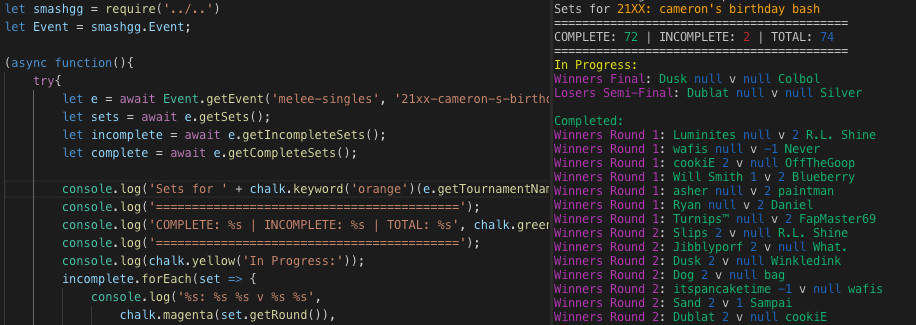

#  **smashgg.js**


 
 


Node.js SDK for the public Smash.gg API, which is rich
with data about tournament brackets that have occurred on their platform.



[See the full sample code](https://github.com/BrandonCookeDev/smashgg.js/blob/master/resources/samples/sample1.js)

## Author: Brandon Cooke
* Organization: [RecursionGG](http://recursion.gg)
* Email: BrandonCookeDev@gmail.com
* Discord: cookiE#7679

## Installation
```bash
npm install --save smashgg.js
```

## Issues
* Please submit any issues or feature requests to the [Issues Section of the Github](https://github.com/BrandonCookeDev/smashgg.js/issues)

## Contents
- [Example](#example)
- [Logging](#logging)
- [Docs](#docs)
    -  [Tournament](#tournament)
    -  [Event](#event)
    -  [Phase](#phase)
    -  [PhaseGroup](#phasegroup)
    -  [Player](#player)
    -  [GGSet](#ggset)
    -  [Character](#character)
    -  [VideoGame](#videogame)
- [Upgrading](#upgrading)

## Example 
```javascript
// Will not work on < NodeJS 7+
(async function(){
    var smashgg = require('smashgg.js');
    var { Tournament } = smashgg;
    var tournament = await Tournament.getTournament('ceo-2016');

    var players = await tournament.getAllPlayers();
    var sets = await tournament.getAllSets();

    console.log(players.length + ' players entered ' + tournament.getName() +  ' overall');
    players.forEach(player => {
        console.log(
            'Tag: ' + player.getTag() + '\n',
            'Name: ' + player.getName() + '\n',
            'State: ' + player.getState() + '\n'
        )
    });

    console.log(sets.length + ' sets were played at ' + tournament.getName());
    sets.forEach(set => {
            console.log(
                '[%s: %s %s - %s %s]',
            set.getRound(),
            set.getWinner().getTag(), //Player object
            set.getWinnerScore(),
            set.getLoserScore(),
            set.getLoser().getTag()
        );
        console.log(
            '%s placed %s at the tournament \n%s placed %s at the tournament\n',
            set.getWinner().getTag(),
            set.getWinnersTournamentPlacement(),
            set.getLoser().getTag(),
            set.getLosersTournamentPlacement()
        )
    })

    console.log('Done!');
    return process.exit(0);
})()
```

##### Output
```
2592 players entered CEO 2016 overall
Tag: Gwabs
 Name: Ian Chiong
 State: FL

Tag: Benteezy
 Name: Benny Frias
 State: NY

Tag: Jinzo
 Name: Gene Zhou
 State: FL

.... continues ....

8150 sets were played at CEO 2016
[Losers Semi-Final: Haus 2 - 1 Benteezy]
Haus placed 33 at the tournament
Benteezy placed 97 at the tournament

[Winners Round 2: Benteezy 2 - 0 Sabelan]
Benteezy placed 97 at the tournament
Sabelan placed 257 at the tournament

[Losers Quarter-Final: Benteezy 2 - 0 NIX]
Benteezy placed 97 at the tournament
NIX placed 129 at the tournament

.... continues ....

```

## Logging
### Winston
You can access the built in Winston logger by using the following methods
```javascript
const smashgg = require('smashgg.js');
let log = smashgg.Log;

log.info('Here\'s some text')
log.debug('Don\'t print this here')

smashgg.setLogLevel('debug')
log.info('Print everything now!!')
log.verbose('Not to be verbose...')
log.debug('but i\'m trying to debug :)')

smashgg.setLogLevel('warn');
```
You can also add a Logger of your own, say if you'd like a File logger added
```javascript
const smashgg = require('smashgg.js')
let log = smashgg.Log

smashgg.addLog('file', {
    filename: '/tmp/log',
    level: 'verbose',
    format: winston.format.combin(
        winston.format.splat(),
        winston.format.simple()
    )
})
```

The following are the operations at your disposal

* **setLogLevel(level)**
    * level: string
        * Valid values are
            * error
            * warn
            * info
            * verbose
            * debug 

* **addLog(type, options)**    
    * type: string
        * valid values:
            * console
            * file
    * options: winston.LoggerOptions
        * if you need this, please see [this link](https://github.com/winstonjs/winston#creating-your-own-logger)

# Docs
## Tournament
A Tournament in smash.gg is a collection of Events, Phases, and Phases Groups that
categorize different games played, game types within those games, and the matches that
make up those games.

```javascript
/* NEW CONVENIENCE FUNCTIONS! */
//Returns a tournament resolving promise
Tournament.getTournament('to12')
    .then(to12 => {
        // do stuff with TO12
    }))

var to12 = new smashgg.Tournament('to12');
to12.on('ready', function(){
    //tournament is populated with data
    console.log('Got tournament ' + tournament.getName();
});

var ceo2016 = new smashgg.Tournament(
    'ceo-2016',
    {
        event: true,
        phase: false,
        groups: false,
        stations: false
    },
    false
);
ceo2016.on('ready', function(){
    //do stuff with ceo2016
})
```

### Constructor
* **Tournament(tournamentName [,options]);**

    * **tournamentName** [required] - name slug or short tournament name
        * a slug is a string that uniquely identifies a tournament on the platform
            * ex: ceo-2016
        * a shortened name is a set abbreviation for a slug
            * ex: to12
    * **options** - object determining options of the Tournament object
        * **rawEncoding** - string value for what encoding the raw Smashgg data should be in
            * Legal values:
                * 'json' - *default* the raw should be kept in JSON format
                * 'utf8' - the raw should be a utf8 string
                * 'base64' - the raw should be a base64 string
        * **expands** - an object that defines which additional data is sent back. By default all values are marked true.
            * event - boolean - condensed data for the events that comprise this tournament
            * phase - boolean -condensed data for the phases that comprise the events
            * groups - boolean -condensed data for the groups that comprise the phases
            * stations - boolean -condensed data for the stations for each group
        * **isCached** - boolean parameter for if the api should cache the resulting object

### Properties
* **data** - a copy of the raw Tournament JSON that comprises this object
* **name** - the tournament name from the constructor
* **rawEncoding** - the encoding type the smashgg raw is in
* **isCached** - True/False value of if the object should be cached
* **expands** - Object that asks smash.gg for more info when api is called
* **expandsString** - url encoded string version of the expands object
* **url** - smash.gg api url used to create this Tournament object

### Events
* **'ready'**
    * indicates when the Tournament object is populated with data
* **'error'**
    * indicates an error occurred when creating the Tournament
    * returns an Error object to be used by the user

### Methods
### Convenience
* **static getTournament(tournamentId [,options])**
    * Returns a Promise that resolves a `Tournament` object
    * **tournamentId** - [*required*] tournament name/slug
    * **options** - options for the Tournament object

#### Aggregation Promises
* **getAllPlayers([options])**
    * Returns a Promise that resolves an array of all `Player` objects that partook in the Tournament
    * **options** - options for the bulk pull proceedure
        * **isCached** - boolean value for if the value should be retrieved from cache. Defaults to true
        * **concurrency** - integer value for how many web request promises should be made concurrently. Defaults to 4
* **getAllSets([options])**
    * Returns a Promise that resolves an array of all `GGSet` objects that took place in the Tournament
    * **options** - options for the bulk pull proceedure
        * **isCached** - boolean value for if the value should be retrieved from cache. Defaults to true
        * **concurrency** - integer value for how many web request promises should be made concurrently. Defaults to 4
* **getAllEvents([options])**
    * Returns a Promise that resolves an array of all `Events` objects that are part of the Tournament.
    * **options** - options for the bulk pull proceedure
        * **isCached** - boolean value for if the value should be retrieved from cache. Defaults to true
        * **concurrency** - integer value for how many web request promises should be made concurrently. Defaults to 4
* **getCompleteSets([options])**
    * Returns a Promise that resolves an array of `GGSet` objects that are completed
    * **options** - options for the bulk pull proceedure
        * **isCached** - boolean value for if the value should be retrieved from cache. Defaults to true
        * **concurrency** - integer value for how many web request promises should be made concurrently. Defaults to 4
* **getIncompleteSets([options])**
    * Returns a Promise that resolves an array of `GGSet` objects that are not completed yet
    * **options** - options for the bulk pull proceedure
        * **isCached** - boolean value for if the value should be retrieved from cache. Defaults to true
        * **concurrency** - integer value for how many web request promises should be made concurrently. Defaults to 4

#### Getters
* **getId()**
    * returns the id of the tournament
* **getName()**
    * returns the name of the tournament
* **getSlug()**
    * returns the slug for the tournament
* **getTimezone()**
    * returns the string timezone the tournament occurred in
* **getStartTime()**
    * returns a JS Date object for the start time of the tournament
* **getStartTimeString()**
    * returns a string 'MM-DD-YYYY HH:mm:ss tz' for the start time of the tournament
* **getEndTime()**
    * returns a JS Date object for the end time of the tournament
* **getEndTimeString()**
    * returns a string 'MM-DD-YYYY HH:mm:ss tz' for the end time of the tournament
* **getWhenRegistrationCloses()**
    * returns a JS Date object for the time registration is set to close
* **getWhenRegistrationClosesString()**
    * returns a string 'MM-DD-YYYY HH:mm:ss tz' for the time registration is set to close
* **getCity()**
    * returns the city where the tournament occurred
* **getState()**
    * returns the state where the tournament occurred
* **getZipCode()**
    * returns the zip code where the tournament occurred
* **getContactEmail()**
    * return the email address listed for contacting
* **getContactTwitter()**
    * return the twitter handle listed for contacting
* **getOwnerId()**
    * return the id of the tournament owner
* **getVenueFee()**
    * return the cost of the venue fee for the tournament
* **getProcessingFee()**
    * return the cost of the processing fee to register for the tournament

## Event
An Event in smash.gg is a broad collection of matches for a single game and game type.
For instance, Melee Singles is an Event while Melee Doubles is another Event. Events
are comprised of optional Phases and Phases Groups.

```javascript
/** NEW CONVENIENCE METHODS **/
Event.getEvent('to12', 'melee-singles')
    .then(event1 => {
        //do stuff with event
    })
Event.getEventById(14335, {rawEncoding: 'base64'})
    .then(event => {
        //do stuff with event
    })

/** OLD METHODS **/
var event1 = new smashgg.Event('to12', 'melee-singles');
event1.on('ready', function(){
    //do stuff with event1
})

var event2 = new smashgg.Event(
    'ceo-2106',
    'melee-singles',
    {
        rawEncoding: 'base64',
        expands:{
            phase: true,
            groups: false
        },
        isCached: false
);
event2.on('ready', function(){
    //do stuff with event2
}

//additional constructor for id-only pulling
var eventId = 14335;
var event3 = new smashgg.Event(eventId, {rawEncoding: 'utf8'});
event3.on('ready', function(){
    //do stuff with event3
})
```

### Constructor
* **Event(eventId [,tournamentId, options])**
    * **eventId** [required] - event id number or slug
        * id ex: 14335
        * slug ex: melee-singles or bracket-pools
    * **tournamentId** [required] - tournament slug (**no longer takes shorthand name of the tournament**)
        * slug: ceo-2016
        * shorthand: *removed by gg* - this object no longer takes shorthand for a tournament slug (eg: *to12 for tipped-off-12-presented-by-the-lab-gaming-center*)
    * **options** - object determining options of the Event object
        * **rawEncoding** - string value for what encoding the raw Smashgg data should be in
            * Legal values:
                * 'json' - *default* the raw should be kept in JSON format
                * 'utf8' - the raw should be a utf8 string
                * 'base64' - the raw should be a base64 string
        * **expands** - an object that defines which additional data is sent back. By default all values are marked true.
            * phase - boolean -condensed data for the phases that comprises the event
            * groups - boolean -condensed data for the groups that comprise the phases
        * **isCached** - boolean value for if the resulting object should be cached

### Properties
* **data** - a copy of the raw Event JSON that comprises this object
* **tournamentName** - the tournament name from the constructor, to which this event belongs
* **eventName** - the event name from the constructor
* **rawEncoding** - the encoding type the smashgg raw is in
* **isCached** - True/False value of if the object should be cached
* **expands** - Object that asks smash.gg for more info when api is called
* **expandsString** - url encoded string version of the expands object
* **url** - smash.gg api url used to create this Event object
* **tournamentSlug** - the api slug for the tournament to which this event belongs

### Events
* **'ready'**
    * indicates when the Event object is populated with data
* **'error'**
    * indicates an error occurred when creating the Event
    * returns an Error object to be used by the user

### Methods
#### Convenience Methods
* **static getEvent(eventId, tournamentId [, options])**
    * Returns a Promise resolving an Event object
    * **eventId** - [*required*] event name/slug
    * **tournamentId** - [*required*] tournament slug/shorthand
    * **options** - options for the Event [in constructor]

* **static getEventById(eventId [, options])**
    * Returns a Promise resolving an Event object
    * **eventId** - [*required*] event numeric id
    * **options** - options for the Event [in constructor]

#### Aggregation Promises
* **getEventPhases([options])**
    * Returns a Promise resolving an array of `Phase` objects for this Event
    * **options** - options for the bulk pull proceedure
        * **isCached** - boolean value for if the value should be retrieved from cache. Defaults to true
        * **concurrency** - integer value for how many web request promises should be made concurrently. Defaults to 4
* **getEventPhaseGroups([options])**
    * Returns a Promise resolving an array of `PhaseGroup` objects for this Event
    * **options** - options for the bulk pull proceedure
        * **isCached** - boolean value for if the value should be retrieved from cache. Defaults to true
        * **concurrency** - integer value for how many web request promises should be made concurrently. Defaults to 4
* **getSets([options])**
    * Returns a Promise resolving an array of `GGSet` objects belonging to this Event
    * **options** - options for the bulk pull proceedure
        * **isCached** - boolean value for if the value should be retrieved from cache. Defaults to true
        * **concurrency** - integer value for how many web request promises should be made concurrently. Defaults to 4
* **getTop8Sets([options]**
    * Returns a Promise resolving an array of Top 8 `GGSet` objects belonging to this Event
    * This function deterministically returns the Top 8 sets of an event by finding the most-likely Phase name (Top 8, Top 64, etc) and aggregating the Top 8 from there.
    * **options** - options for the bulk pull proceedure
        * **isCached** - boolean value for if the value should be retrieved from cache. Defaults to true
        * **concurrency** - integer value for how many web request promises should be made concurrently. Defaults to 4
* **getPlayers([options])**
    * Returns a Promise resolving an array of `Player` objects belonging to this Event
    * **options** - options for the bulk pull proceedure
        * **isCached** - boolean value for if the value should be retrieved from cache. Defaults to true
        * **concurrency** - integer value for how many web request promises should be made concurrently. Defaults to 4
* **getCompleteSets([options])**
    * Returns a Promise that resolves an array of `GGSet` objects that are completed
    * **options** - options for the bulk pull proceedure
        * **isCached** - boolean value for if the value should be retrieved from cache. Defaults to true
        * **concurrency** - integer value for how many web request promises should be made concurrently. Defaults to 4
* **getIncompleteSets([options])**
    * Returns a Promise that resolves an array of `GGSet` objects that are not completed yet
    * **options** - options for the bulk pull proceedure
        * **isCached** - boolean value for if the value should be retrieved from cache. Defaults to true
        * **concurrency** - integer value for how many web request promises should be made concurrently. Defaults to 4

#### Getters
* **getName()**
    * returns the name of the event
* **getSlug()**
    * returns the slug for the event
* **getStartTime()**
    * returns a JS Date object for when the event is set to begin
* **getStartTimeString()**
    * returns a date string (MM-DD-YYYY HH:mm:ss tz) for when the event is set to begin
* **getEndTime()**
    * returns a JS Date object for when the event is set to end
* **getEndTimeString()**
    * returns a date string (MM-DD-YYYY HH:mm:ss tz) for when the event is set to end

## Phase
A phase in smash.gg is a subset of matches and brackets inside an Event. For example,
a wave in pools is a Phase. Everything in that Phase is a Group (or Phase Group).

```javascript
/** NEW CONVENIENCE METHODS **/
Phase.getPhase(111483)
    .then(phase => {
        //do stuff with phase
    })
Phase.getPhase(45262, {
    rawEncoding: 'base64',
    expands: {
        groups: false
    },
    isCached: false
}).then(phase =>{
    //do stuff with phase
})

var phase1 = new smashgg.Phase(111483);
phase1.on('ready', function(){
    //do stuff with phase1
})

var phase2 = new smashgg.Phase(
    45262,
    {
        rawEncoding: 'base64',
        expands: {
            groups: false
        },
        isCached: false
    }
)
phase2.on('ready', function(){
    //do stuff with phase2
})
```

### Constructor
* **Phase(id [, options])**
    * **id** [required] - unique identifier for the Phase
    * **options** - object determining options of the Phase object
        * **rawEncoding** - string value for what encoding the raw Smashgg data should be in
            * Legal values:
                * 'json' - *default* the raw should be kept in JSON format
                * 'utf8' - the raw should be a utf8 string
                * 'base64' - the raw should be a base64 string
        * **expands** - an object that defines which additional data is sent back. By default all values are marked true.
            * groups - boolean -condensed data for the groups that comprise the phases
        * **isCached** - boolean parameter for if the api should cache the resulting object

### Properties
* **data** - a copy of the raw Phase JSON that comprises this object
* **id** - the id from the constructor, a unique identifier for the phase
* **rawEncoding** - the encoding type the smashgg raw is in
* **isCached** - True/False value of if the object should be cached
* **expands** - Object that asks smash.gg for more info when api is called
* **expandsString** - url encoded string version of the expands object
* **url** - smash.gg api url used to create this Phase object

### Events
* **'ready'**
    * indicates when the Phase object is populated with data
* **'error'**
    * indicates an error occurred when creating the Phase
    * returns an Error object to be used by the user

### Methods
#### Convenience Methods
* **static getPhase(id [, options])**
    * Returns a Promise resolving a Phase object
    * **id** - [*required*] Id of the Phase
    * **options** - options for the Phase object

#### Aggregation Promises
* **getPhaseGroups([options])**
    * Returns a Promise resolving an array of `PhaseGroup` objects belonging to this Phase
    * **options** - options for the bulk pull proceedure
        * **isCached** - boolean value for if the value should be retrieved from cache. Defaults to true
        * **concurrency** - integer value for how many web request promises should be made concurrently. Defaults to 4
* **getSets([options])**
    * Returns a Promise resolving an array of `GGSet` objects belonging to this Phase
    * **options** - options for the bulk pull proceedure
        * **isCached** - boolean value for if the value should be retrieved from cache. Defaults to true
        * **concurrency** - integer value for how many web request promises should be made concurrently. Defaults to 4
* **getPlayers([options])**
    * Returns a Promise resolving an array of `Player` objects belonging to this Phase
    * **options** - options for the bulk pull proceedure
        * **isCached** - boolean value for if the value should be retrieved from cache. Defaults to true
        * **concurrency** - integer value for how many web request promises should be made concurrently. Defaults to 4
* **getCompleteSets([options])**
    * Returns a Promise that resolves an array of `GGSet` objects that are completed
    * **options** - options for the bulk pull proceedure
        * **isCached** - boolean value for if the value should be retrieved from cache. Defaults to true
        * **concurrency** - integer value for how many web request promises should be made concurrently. Defaults to 4
* **getIncompleteSets([options])**
    * Returns a Promise that resolves an array of `GGSet` objects that are not completed yet
    * **options** - options for the bulk pull proceedure
        * **isCached** - boolean value for if the value should be retrieved from cache. Defaults to true
        * **concurrency** - integer value for how many web request promises should be made concurrently. Defaults to 4

    

#### Getters
* **getName()**
    * returns the name of the Phase
* **getEventId()**
    * returns the id of the Event this Phase belongs to

## PhaseGroup
A Phase Group is the lowest unit on smash.gg. It is a bracket of some sort that belongs to a Phase.

```javascript
/** NEW CONVENIENCE METHODS **/
PhaseGroup.getPhaseGroup(44445)
    .then(phaseGroup => {
        //do stuff with phaseGroup
    })
PhaseGroup.getPhaseGroup(301994, {
    rawEncoding: 'base64',  
    expands: {
        sets: true,
        entrants: true,
        standings: true,
        seeds: false
    },
    isCached: false
}).then(phaseGroup => {
    //do stuff with phaseGroup
})

var phaseGroup1 = new smashgg.PhaseGroup(44445);
phaseGroup1.on('ready', function(){
    //do stuff with phaseGroup1
})

var phaseGroup2 = new smashgg.PhaseGroup(
    301994,
    {
        rawEncoding: 'base64',
        expands: {
            sets: true,
            entrants: true,
            standings: true,
            seeds: false
        },
        isCached: false
    }
);
phaseGroup2.on('ready', function(){
    //do stuff with phaseGroup2
})
```

### Constructor
* **PhaseGroup(id, options)**
    * **id** [required] - unique identifier for this Phase Group
    * **options** - object determining options of the Tournament object
        * **rawEncoding** - string value for what encoding the raw Smashgg data should be in
            * Legal values:
                * 'json' - *default* the raw should be kept in JSON format
                * 'utf8' - the raw should be a utf8 string
                * 'base64' - the raw should be a base64 string
        * **expands** - an object that defines which additional data is sent back. By default all values are marked true.
            * sets - boolean - data for the sets that comprises the phase group
            * entrants - boolean - data for the entrants that comprise the phase group
            * standings - boolean - data for the standings of the entrants for the phase group
            * seeds - boolean - data for the seeding of entrants for the for the phase group
        * **isCached** - boolean value for if the resulting object should be cached

### Properties
* **data** - a copy of the raw PhaseGroup JSON that comprises this object
* **id** - the id from the constructor, a unique identifier for the Phase Group
* **rawEncoding** - the encoding type the smashgg raw is in
* **isCached** - True/False value of if the object should be cached
* **expands** - Object that asks smash.gg for more info when api is called
* **expandsString** - url encoded string version of the expands object
* **url** - smash.gg api url used to create this PhaseGroup object

### Events
* **'ready'**
    * indicates when the PhaseGroup object is populated with data
* **'error'**
    * indicates an error occurred when creating the Phase Group
    * returns an Error object to be used by the user

### Methods
#### Convenience Methods
* **static getPhaseGroup(id [, options])**
    * Returns a Promise resolving a PhaseGroup object
    * **id** - [*required*] id of the Phase Group
    * **options** - options for the PhaseGroup object

#### Aggregation Promises
* **getPlayers([options])**
    * Returns a Promise that resolves an array of `Player` objects for the Phase Group.
    * **options** - options for the bulk pull proceedure
        * **isCached** - boolean value for if the value should be retrieved from cache. Defaults to true
* **getSets([options])**
    * Return a Promise that resolves an array of `GGSet` objects for the Phase Group.
    * **options** - options for the bulk pull proceedure
        * **isCached** - boolean value for if the value should be retrieved from cache. Defaults to true
* **getCompleteSets([options])**
    * Returns a Promise that resolves an array of `GGSet` objects that are completed
    * **options** - options for the bulk pull proceedure
        * **isCached** - boolean value for if the value should be retrieved from cache. Defaults to true
        * **concurrency** - integer value for how many web request promises should be made concurrently. Defaults to 4
* **getIncompleteSets([options])**
    * Returns a Promise that resolves an array of `GGSet` objects that are not completed yet
    * **options** - options for the bulk pull proceedure
        * **isCached** - boolean value for if the value should be retrieved from cache. Defaults to true
        * **concurrency** - integer value for how many web request promises should be made concurrently. Defaults to 4


#### Getters
* **getPhaseId()**
    * returns the Phase Id that owns this Phase Group

## Player
A Player is a data object that holds information about players who
went to a tournament using smash.gg.
```javascript
var player = new smashgg.Player(000000, 'cookiE', 'Brandon Cooke', 'US', 'GA', 'Recursion');

var tournament = smashgg.Tournament('to12');
tournament.on('ready', async function(){
    var players = await tournament.getAllPlayers();
    //returns all players in a tournament as Player objects
});
```

### Constructor
* **Player(id [, tag, name, country, state/region, sponsor/prefix, participantId, data])**
    * **id** [required] - the global id for the player in smash.gg
    * **tag** - smash tag of the player
    * **name** - real name of the player
    * **country** - country the player hails from
    * **state/region** - state or region the player is from in the country
    * **sponsor/prefix** - the sponsor (or user selected prefix) of the player
    * **participantId** - the participant id the player was assigned upon registering for a tournament
    * **data** - the raw player data from smash.gg

### Properties
* no additional properties for Player

### Methods
#### Convenience
* **static async getPlayer(id [, options])**
    * This method returns a Promise resolving a Player object for the given ID
    * **id** [required] -  Global ID number in smashgg
    * **options**
        * **isCached** - Boolean for if the value should be pulled from cache or put in cache

#### Statics
* **resolve(data)**
    * **data** - the raw player data from smash.gg
    * this method takes the raw json payload of a single player in the system and returns a player object

#### Getters
* **getId()**
    * return the id of the Player
* **getTag()**
    * return the tag of the Player
* **getName()**
    * return the name of the Player
* **getCountry()**
    * return the country of the Player
* **getState()**
    * return the state of the Player
* **getSponsor()**
    * return the Sponsor of the Player
* **getParticipantId()**
    * return the participant id of the Player
* **getFinalPlacement()**
    * requires **data** property
    * return the final placement of the Player

## GGSet
A Set is a data object that holds information about a tournament set
that took place at a tournament.

```javascript
var Player1 = new smashgg.Player(000000, 'BootyBlastWarrior', 'Andy', 'US', 'GA', null);
var Player2 = new smashgg.Player(000001, 'cookiE', 'Brandon Cooke', 'US', 'GA', 'Recursion');

var set = new smashgg.GGSet(000001, 000002, 'Losers Semis', Player1, Player2, true, 3, 2, 000000, 000001);
var set2 = new smashgg.GGSet(000002, 000003, 'Grand Finals', Player1, Player2, false)

var tournament = new smashgg.Tournament('to12');
tournament.on('ready', async function(){
    var sets = await tournament.getAllSets();
    //returns a list of Set objects from the tournament
})

var set1 = await smashgg.getSet(1202)
```

### Constructor
* **GGSet(id, eventId, round, Player1, Player2 [, isComplete, score1, score2, winnerId, loserId, data])**
    * **id** [required] - unique identifier of the Set object
    * **eventId** [required] - id of the event this Set belongs to
    * **round** [required] - round name of the Set
    * **Player1** [required] - Player object of the first player of the Set
    * **Player2** [required] - Player object of the second player of the Set
    * **isComplete** - Boolean for if the set is complete
    * **score1** - Integer score for player1 of the set
    * **score2** - Integer score for player2 of the set
    * **winnerId** - ID of the Winning Player of the set
    * **loserId** - ID of the Losing Player of the set
    * **data** - Raw data of the Set back from Smash.gg

### Properties
* no additional properties for Set

### Methods
#### Convenience
* **static async getSet(id [, options])**
    * This method returns a Promise that resolves a Set object from the given ID
    * **id** [required] - ID number of the set in smashgg's system
    * **options** 
        * **isCached** - Boolean value for if the set should be pulled from cache or put in

#### Getters
* **getRound()**
    * return the round name for the Set
* **getWinner()**
    * return the Winner Player object for the Set
* **getLoser()**
    * return the Loser Player object for the Set
* **getWinnerId()**
    * return the Winner Player ID for the Set
* **getLoserId()**
    * return the Loser Player ID for the Set
* **getGames()**
    * return the list of Games for the Set if available
* **getBestOfCount()**
    * return the best-of count for the Set
* **getWinnerScore()**
    * return the winner's score for the Set
* **getLoserScore()**
    * return the loser's score for the Set
* **getBracketId()**
    * return the bracket id for the Set
* **getMidsizeRoundText()**
    * return the midsize round text for the Set
* **getPhaseGroupId()**
    * return the phase id for the Phase which this Set belongs to
* **getWinnersTournamentPlacement()**
    * return the Set winner's final tournament placing
* **getLosersTournamentPlacement()**
    * return the Set loser's final tournament placing
* **getStartedAt()**
    * returns a Date object for the time the Set was begun
* **getCompletedAt()**
    * returns a Date object for the time the Set was completed

## Character
A Character object encapsulates data about a fighting game character in the smashgg system
```javascript
let meleeCharacters = await Character.getByGameName('melee');
let pmCharacters = await Character.getByGameId(2);

let allBowsers = await Character.getByName('bowser');
allBowsers.forEach(bowser => {
    console.log(bowser);
});

let allCharacters = await Character.getAll({isCached: false});
allCharacters.forEach(character => {
    console.log(character)
})

let meleeBowser = await Character.getByNameAndGame('bowser', 'melee');
let wolfPM = await Character.getByNameAndGameId('wolf', 2);
```

### Constructor
* **Character(id, name, isCommon, videogameId)**
    * **id** - ID number of the character in the smashgg system
    * **name** - Name of the character
    * **isCommon** - T/F value for if the character is a common one
    * **videogameId** - ID of the SmashGG VideoGame this character belongs to

### Methods
#### Promises
* **static async getAll([options])**
    * Returns a Promise resolving an array of `Character` objects representing all characters in SmashGG
    * **options** - object containing options for the function
        * **isCached** - boolean value for if the results should be fetched/put into cache. Default is true
* **static async getById(id [, options])**
    * Returns a Promise resolving a `Character` object representing the character in SmashGG with the given id
    * **id** - [*required*] ID number of the character in SmashGG's system
    * **options** - object containing options for the function
        * **isCached** - boolean value for if the results should be fetched/put into cache. Default is true
* **static async getByName(name [, options])**
    * Returns a Promise resolving an Array of `Character` objects representing the character in SmashGG that match the given name
    * **name** - [*required*] Name of the desired character in SmashGG's system
    * **options** - object containing options for the function
        * **isCached** - boolean value for if the results should be fetched/put into cache. Default is true
* **static async getByGameId(id [, options])**
    * Returns a Promise resolving an Array of `Character` objects representing all the characters from the given Smashgg videogame Id
    * **id** - [*required*] Id of the SmashGG VideoGame which to fetch all characters from
    * **options** - object containing options for the function
        * **isCached** - boolean value for if the results should be fetched/put into cache. Default is true
* **static async getByGameName(name [, options])**
    * Returns a Promise resolving an Array of `Character` objects representing all the characters from the given Smashgg videogame name/slug/displayname
    * **name** - [*required*] Display Name/short name/nickname of the game in SmashGG's system
    * **options** - object containing options for the function
        * **isCached** - boolean value for if the results should be fetched/put into cache. Default is true
* **static async getByNameAndGameId(name, videogameId [, options])**
    * Returns a Promise resolving a `Character` object from the SmashGG Character name and the VideoGame ID
    * **name** - [*required*] Name of the character in SmashGG's system
    * **videogameId** - [*required*] ID number of the videogame in SmashGG's system
    * **options** - object containing options for the function
        * **isCached** - boolean value for if the results should be fetched/put into cache. Default is true
* **static async getByNameAndGame(name, gameName [, options])**
    * Returns a Promise resolving a `Character` object from the SmashGG Character name and the Videogame name
    * **name** - [*required*] Name of the character in SmashGG"s system
    * **gameName** - [*required*] Display name/name/slug of the SmashGG video game
    * **options** - object containing options for the function
        * **isCached** - boolean value for if the results should be fetched/put into cache. Default is true

#### Getters
* **getId()** - returns the SmashGG Character ID 
* **getName()** - returns the Name of the character
* **getIsCommon()** - returns the T/F isCommon value of the character
* **getVideoGameId()** - return the SmashGG VideoGame ID that the character belongs to


## VideoGame
A VideoGame object encapsulates data about VideoGames respective to how they are known in Smash GG's system
```javascript
let melee = await VideoGame.getByName('melee');
/* produces: 
{   id:1,
    name:'Super Smash Bros. Melee',
    abbrev:'Melee',
    displayName:'Melee',
    minPerEntry:1,
    maxPerEntry:2,
    approved:true,
    slug:'melee',
    isCardGame:null
}
*/

let pm = await VideoGame.getById(2);
/* produces:
{
    id:2,
    name:'Project M',
    abbrev:'pm',
    displayName:'PM',
    minPerEntry:null,
    maxPerEntry:null,
    approved:true,
    slug:'pm',
    isCardGame:null
}
*/

let allGames = await VideoGame.getAll()
/* produces array of all VideoGame objects in SmashGG */
```

### Constructor
* **VideoGame(id, name, abbrev, displayName, minPerEntry, maxPerEntry, approved, slug, isCardGame)**
    * **id** - id number of the game
    * **name** - full name of the game
    * **abbrev** - abbreviated name of the game
    * **displayName** - display name of the game on smashgg's site
    * **minPerEntry** - minimum number of entrants that can sign up
    * **maxPerEntry** - maximum number of entrants that can sign up
        * eg: Melee is 2 because of doubles, two individuals can sign up at once
    * **approved** - boolean if the game has been approved in smashgg's system
    * **slug** - the game's url slug
    * **isCardGame** - boolean for if the game is a card game

### Methods
#### Statics
* **static async getAll([options])**
    * Returns an array of VideoGame objects representing every game in smashgg's system
    * **options** - optional options object
        * **isCached** - boolean for if the value should be cached/pulled from cache

* **static async getByName(name [,options])**
    * Returns a VideoGame object representing the video game belonging to the given name
        * This value will match the games `name`, `abbrev`, `displayName`, and `slug` properties
    * **name** - [*required*] - name, abbrev, displayName, or slug of the desired game
    * **options** - optional options object
        * **isCached** - boolean for if the value should be cached/pulled from cache

* **static async getById(id [,options])**
    * Returns a VideoGame object representing the video game belonging to the given id
    * **id** - [*required*] - id of the desired game
    * **options** - optional options object
        * **isCached** - boolean for if the value should be cached/pulled from cache

#### Getters
* **getId()**
    * return the id of the Video Game
* **getName()**
    * return the full name of the Video Game
* **getAbbreviation()**
    * return the abbreviation of the Video Game
* **getDisplayName()**
    * return the smashgg display name of the Video Game
* **getMinPerEntry()**
    * return the minimum number of participants for an entry of the Video Game
* **getMaxPerEntry()**
    * return the maximum number of participants for an entry of the Video Game
* **getApproved()**
    * return the boolean value of if the Video Game has been approved for smashgg
* **getSlug()**
    * return the url slug of the Video Game
* **getIsCardGame()**
    * return the boolean value of if the Video Game is a card game

## Upgrading
This section is for detailing the transition between major versions. 

### V2 to V3
In order to transition successfully from V2 to V3, please ensure the following 
All `Set` objects created by smashgg.js are renamed to GGSet

### V1 to V2
In order to transition successfully from V1 to V2, please ensure the following 
* Event constructors now take eventId parameter before tournamentId parameter.
    * Additionally, you can give the constructor an Id number for the event, and null tournamentId.
* `Tournament`, `Event`, `Phase`, and `PhaseGroup` constructors now take an `options` object that encapsulates the previous `isCached` and `expands` parameters. 
    * Please see documentation for further implementation.
* It is suggested you move to the Promise returning convenience methods, as the previous `ready` event will be deprecated from this point on.
    * Please see documentation for the convenience methods. They take the same parameters as the constructor.
