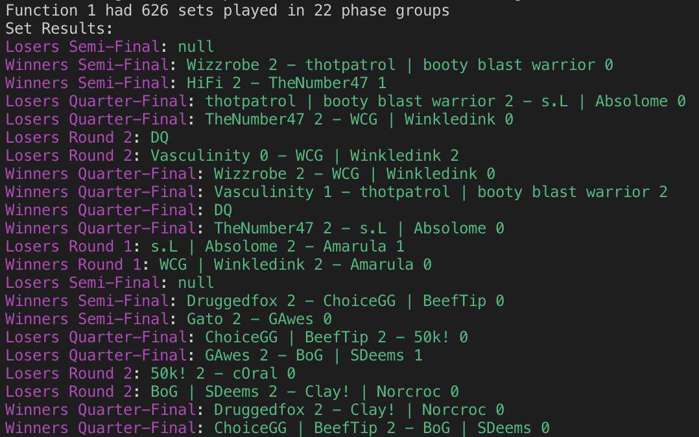

#  **smashgg.js**


 
 


Node.js SDK for the public Smash.gg API, which is rich
with data about tournament brackets that have occurred on their platform.
 
```js
require('colors');
const smashgg = require('smashgg.js');
const {Event} = smashgg;

smashgg.initialize('<your api key>');

(async function(){
    let tournamentSlug = 'function-1-recursion-regional';
    let eventSlug = 'melee-singles';
    let meleeAtFunction = await Event.get(tournamentSlug, eventSlug);

    let sets = await meleeAtFunction.getSets();
    let phaseGroups = await meleeAtFunction.getPhaseGroups();

    console.log('Function 1 had %s sets played in %s phase groups', 
        sets.length, phaseGroups.length);

    console.log('Set Results:')
    for(var i in sets){
        console.log(`${String(sets[i].getFullRoundText()).magenta}: ${String(sets[i].getDisplayScore()).green}`);
    }

    return true; // exit async
})()
```

Results: 


## Author: Brandon Cooke
* Organization: [RecursionGG](http://recursion.gg)
* Email: BrandonCookeDev@gmail.com
* Discord: cookiE#7679

## Installation
```bash
npm install --save smashgg.js
```

## Issues
* Please submit any issues or feature requests to the [Issues Section of the Github](https://github.com/BrandonCookeDev/smashgg.js/issues)

## Contents
- [Getting Started](#getting-started)
- [Limitations](#limitations)
- [Access V1-V3](#access-v1-v3)
- [Logging](#logging)
- [Docs](#docs)
    -  [Tournament](https://github.com/BrandonCookeDev/smashgg.js/wiki/Tournament)
    -  [Event](https://github.com/BrandonCookeDev/smashgg.js/wiki/Event)
    -  [Phase](https://github.com/BrandonCookeDev/smashgg.js/wiki/Phase)
    -  [PhaseGroup](https://github.com/BrandonCookeDev/smashgg.js/wiki/PhaseGroup)
    -  [User](https://github.com/BrandonCookeDev/smashgg.js/wiki/User)
    -  [Attendee](https://github.com/BrandonCookeDev/smashgg.js/wiki/Attendee)
    -  [Entrant](https://github.com/BrandonCookeDev/smashgg.js/wiki/Entrant)
    -  [Standings](https://github.com/BrandonCookeDev/smashgg.js/wiki/Standings)
    -  [GGSet](https://github.com/BrandonCookeDev/smashgg.js/wiki/GGSet)
    -  [Stream](https://github.com/BrandonCookeDev/smashgg.js/wiki/Stream)
    -  [StreamQueue](https://github.com/BrandonCookeDev/smashgg.js/wiki/StreamQueue)
    -  [Character](https://github.com/BrandonCookeDev/smashgg.js/wiki/Character)
    -  [VideoGame](https://github.com/BrandonCookeDev/smashgg.js/wiki/VideoGame)
- [Upgrading](#upgrading)

---

## Getting Started
To begin coding with the SDK, you need an Access Token. You may get one by 
[Joining the Smash.gg discord](http://bit.ly/sggDiscord) and asking Furtive for an
API key. 

Once you have this key, you may use the following function to authenticate with the API
and then you may move on
```js
// import the SDK
const smashgg = require('smashgg.js');

// authenticate with key
smashgg.initialize('<your api key here>');
```

---

## Limitations
Currently, `smashgg.js` is limited by Smash.gg's rate limiting rules. Those are currently
80 requests per 60 seconds. That is, every request made to the API starts a 60 second timer. 
If 80 requests are made before the first 60 second timer is completed, your next request will 
be dropped.

This SDK implements a Queueing system when your code becomes "Delinquent", that is it has made
too many requests too fast. Your requests won't be dropped, but rather will wait until the next
available request slot opens.

If you wish to see this queuing info, it is recommended you maintain the "info" logging level
(See [Logging](#logging)).

---

## Access to V1-V3
The original API has no Sunset date set currently. While this is the case, I thought it best
to make the original SDK available to people so that they may maintain their apps while beginning
to move into V4. You may access v1-v3 SDK as follows:

```js
let smashggV1 = require('smashgg.js/src/v1');
```

---

## Logging
### Winston
You can access the built in Winston logger by using the following methods
```javascript
const smashgg = require('smashgg.js');
let log = smashgg.Log;

log.info('Here\'s some text')
log.debug('Don\'t print this here')

smashgg.setLogLevel('debug')
log.info('Print everything now!!')
log.verbose('Not to be verbose...')
log.debug('but i\'m trying to debug :)')

smashgg.setLogLevel('warn');
```
You can also add a Logger of your own, say if you'd like a File logger added
```javascript
const smashgg = require('smashgg.js')
let log = smashgg.Log

smashgg.addLog('file', {
    filename: '/tmp/log',
    level: 'verbose',
    format: winston.format.combin(
        winston.format.splat(),
        winston.format.simple()
    )
})
```

The following are the operations at your disposal

* **setLogLevel(level)**
    * level: string
        * Valid values are
            * error
            * warn
            * info
            * verbose
            * debug 

* **addLog(type, options)**    
    * type: string
        * valid values:
            * console
            * file
    * options: winston.LoggerOptions
        * if you need this, please see [this link](https://github.com/winstonjs/winston#creating-your-own-logger)

* **disableLog()**
    * disabled the embedded logger

* **enableLog()**
    * enables the embedded logger

---

## Upgrading
This section is for detailing the transition between major versions. 

### V3 to V4
Easily the largest change that has occurred in the lifespan of this SDK. Please read carefully to 
successfully upgrade versions.

* All major objects (`Tournament`, `Event`, `Phase`, `PhaseGroup`) have refactored the main getter renamed to `get()`
    * `Tournament.getTournament(slug)` ==> `Tournament.get(slug)`
    * `Event.getEvent(eventName, tournamentName)` ==> `Event.get(tournamentName, eventName)`
    * `Phase.getPhase(id)` ==> `Phase.get(id)`
    * `PhaseGroup.getPhaseGroup(id)` ==> `PhaseGroup.get(id)`
* `Event` no longer accepts `Tournament` slug shorthand
    * shorthand like "function1" need to be refactored to their full slug version like "function-1-recursion-regional"
* `Tournament` no longer has aggregate functions like `getAllSets()` or `getAllPlayers()`
    * due to the [limitations](#limitations), the SDK can no longer support aggregate functions for Tournament objects, 
    I recommend using individual `Event` objects to accomplish your goals
* Take caution in doing aggregate functions on `Events` of very large size, like Evo Melee or something similar. You could 
find yourself hitting the rate limit very easily.

#### Maintaining V1-V3
As described in [Access V1-V3](#access-v1-v3), you may use the original SDK while it has not been 
Sunset. See that section for more details.

### V2 to V3
In order to transition successfully from V2 to V3, please ensure the following 
All `Set` objects created by smashgg.js are renamed to GGSet

### V1 to V2
In order to transition successfully from V1 to V2, please ensure the following 
* Event constructors now take eventId parameter before tournamentId parameter.
    * Additionally, you can give the constructor an Id number for the event, and null tournamentId.
* `Tournament`, `Event`, `Phase`, and `PhaseGroup` constructors now take an `options` object that encapsulates the previous `isCached` and `expands` parameters. 
    * Please see documentation for further implementation.
* It is suggested you move to the Promise returning convenience methods, as the previous `ready` event will be deprecated from this point on.
    * Please see documentation for the convenience methods. They take the same parameters as the constructor.
